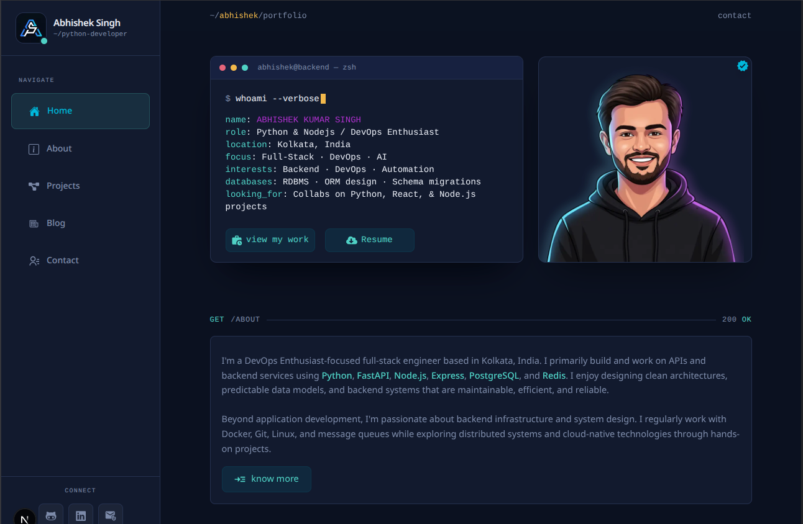

<div align="center">

# ⚡ Abhishek Kumar Singh
### Backend & Full-Stack Engineer · Distributed Systems · DevOps

[](https://nextjs.org/)
[](https://react.dev/)
[](https://www.typescriptlang.org/)
[](https://tailwindcss.com/)
[](https://greensock.com/gsap/)
[](https://opensource.org/licenses/MIT)

<br/>

**[🌐 Explore Live Deployment](https://developerabhishek.me)** &nbsp;|&nbsp;
**[📄 View Resume](https://developerabhishek.me/Resume.pdf)** &nbsp;|&nbsp;
**[📫 Contact Abhishek](https://developerabhishek.me/contact)** &nbsp;|&nbsp;
**[🚀 Browse Projects](https://developerabhishek.me/projects)**

<br/>

<p align="center">
  
</p>

</div>

---

## 📖 Overview

A high-performance personal developer portfolio and engineering hub built from the ground up with **Next.js 16 App Router**, **React 19**, and **Tailwind CSS v4**.

Engineered around a **RESTful API and Developer Terminal aesthetic**, the application models every page section as an HTTP request/response cycle (`GET /about`, `GET /stack`, `POST /collab`, `POST /in-development`) complete with status badges (`200 OK`, `202 Queued`), simulated latency metrics, and an interactive 60 FPS canvas constellation background.

```bash
$ curl -X GET https://api.abhishek.dev/v1/profile

{
  "status": 200,
  "developer": "Abhishek Kumar Singh",
  "role": "Backend & Full-Stack Developer",
  "focus": ["FastAPI", "Python", "Node.js", "Docker", "PostgreSQL", "Redis", "Distributed Systems"],
  "availability": "Open for Full-Time Roles & High-Impact Engineering Collaborations"
}
```

---

## ✨ Key Features

### 💻 Interactive Developer Terminal Hero
- **Simulated CLI Session**: Realistic typewriter animation typing `curl -X GET api.abhishek.dev/v1/profile`.
- **Live Response Payloads**: Formatted JSON response stream displaying roles, core stack, and live availability.
- **Orbital Tech Orbit**: Profile avatar surrounded by floating, animated tech badges (Python, FastAPI, JS, Docker, PostgreSQL, Redis) with physics-based floating keyframes.
- **Reduced Motion Respect**: Seamlessly falls back to instant rendering when `prefers-reduced-motion` is enabled.

### 🌐 REST API Endpoint UI Concept
- **HTTP Routing Badges**: Method pills (`GET`, `POST`, `200 OK`, `202 Queued`) embedded across every major content section.
- **Realistic Network Latency Indicators**: Simulated ping telemetry (`14ms`) and live Indian Standard Time (IST) uptime clocks.

### 🌌 60 FPS Particle Constellation Canvas
- Custom HTML5 Canvas engine rendering an interactive constellation of nodes and connections.
- Dynamically responds to cursor distance, particle collisions, and viewport resize events with negligible CPU footprint.

### 🚀 Dynamic Projects Engine (`/projects/[slug]`)
- **Rich Case Studies**: Detailed breakdowns of real-world backend microservices, sandboxes, and web platforms (e.g., *Jobify AI*, *Code0 Sandbox*, *Markdown Converter*, *BuyNow Platform*).
- **In-Development Queue (`POST /in-development`)**: Live tracker for ongoing engineering experiments and upcoming open-source initiatives.
- **Direct Links**: Live demo URLs and GitHub source code repositories.

### 📬 Production-Ready SMTP Mailer Service
- **Type-Safe Ingestion**: Validates incoming payload using **Zod** schemas (`name`, `email`, `message`).
- **Nodemailer Integration**: Next.js route handler (`POST /api/send-mail`) dispatching styled HTML emails with anti-injection escaping.
- **Interactive UI Feedback**: Smooth toast feedback notifications powered by `react-hot-toast`.

### 🎨 Cyberpunk-Minimal Glassmorphic Design
- Ultra-dark color palette (`#0B1120` canvas, `#121A2E` cards, `#26314f` borders).
- Neon accents: Cyber Cyan (`#4FD1C5`), Emerald Green (`#36c766`), and Amber Gold (`#F2B84B`).
- Backdrop filters, subtle glow effects, and modern custom scrollbars.
- Font pairing of **JetBrains Mono** (monospace code accents) and **Plus Jakarta Sans** (clean modern typography).

---

## 🗺️ Application Architecture & Routes

| HTTP Route | Method | Component / Purpose | Status Code |
|:---|:---:|:---|:---:|
| [`/`](https://developerabhishek.me) | `GET` | **Terminal Hero**, Quick Bio, Tech Stack Preview, Core Focus Areas | `200 OK` |
| [`/about`](https://developerabhishek.me/about) | `GET` | **Extended Bio**, Experience Timeline, Skill Matrix, Certifications, Engineering Principles | `200 OK` |
| [`/projects`](https://developerabhishek.me/projects) | `GET` | **Production Projects Grid** & `/in-development` Task Queue | `200 OK` |
| `/projects/[slug]` | `GET` | **Dynamic Deep-Dive Project Page** (Features, Architecture, Links) | `200 OK` |
| [`/blog`](https://developerabhishek.me/blog) | `GET` | **Engineering Publications Roadmap** (Docker, Redis, Query Optimization) | `202 Queued` |
| [`/contact`](https://developerabhishek.me/contact) | `GET` | **Interactive Contact Form** & Direct Social Connections | `200 OK` |
| `/api/send-mail` | `POST` | **Nodemailer SMTP Route Handler** with Zod schema validation | `200 OK` |

---

## 🛠️ Technology Stack

<div align="center">

| Domain | Technologies |
|:---|:---|
| **Core Framework** | [Next.js 16](https://nextjs.org/) (App Router), [React 19](https://react.dev/), [TypeScript 6](https://www.typescriptlang.org/) |
| **Styling & Design** | [Tailwind CSS v4](https://tailwindcss.com/), PostCSS, Custom Glassmorphism, CSS Backdrop Filters |
| **Animation & Canvas** | [GSAP 3.15](https://greensock.com/gsap/), HTML5 Canvas 2D Particle Engine, `tw-animate-css` |
| **Icons & Primitives** | [React Icons](https://react-icons.github.io/react-icons/), [Lucide React](https://lucide.dev/), [Base UI](https://base-ui.com/) |
| **Backend & Routing** | Next.js Route Handlers (`/api`), [Nodemailer](https://nodemailer.com/), [Zod](https://zod.dev/) Validation |
| **Notification & Forms** | [React Hot Toast](https://react-hot-toast.com/), Custom HTML email template generation |
| **Typography** | `Plus Jakarta Sans` (Sans-Serif), `JetBrains Mono` (Monospace) |
| **Package Management** | [Bun](https://bun.sh/) / [npm](https://www.npmjs.com/) |

</div>

---

## 📂 Project Structure

```text
portfolio-blog/
├── public/
│   ├── images/              # Profile portraits and logos (my-pic.png, abhi-logo.jpg)
│   ├── project-images/      # Thumbnails and project architecture screenshots
│   ├── Resume.pdf           # Downloadable curriculum vitae
│   └── favicon.ico          # Browser favicon
├── src/
│   ├── app/
│   │   ├── about/           # /about route (Bio, Experience, Principles, Certifications)
│   │   ├── api/
│   │   │   └── send-mail/   # POST /api/send-mail route handler
│   │   ├── blog/            # /blog roadmap & upcoming engineering write-ups
│   │   ├── contact/         # /contact interactive message form
│   │   ├── projects/        # /projects listing page
│   │   │   └── [slug]/      # Dynamic project case study routes
│   │   ├── utils/           # HTML email templating & string helpers
│   │   ├── globals.css      # Tailwind v4 theme, neon glow, and glass styles
│   │   ├── layout.tsx       # Root layout with ParticleBackground, fonts & metadata
│   │   └── page.tsx         # Homepage with HeroTerminal, Focus & Quick Bio
│   ├── components/
│   │   ├── about/           # ExperienceSection and timeline components
│   │   ├── contact/         # ContactComponent with form state & toast alerts
│   │   ├── graphics/        # 60 FPS ParticleBackground Canvas implementation
│   │   ├── home/            # HeroTerminal typewriter CLI component
│   │   ├── motion/          # GSAP scroll triggers & reveal wrappers
│   │   ├── navbar/          # Glassmorphic top navigation bar & NavLink
│   │   ├── project/         # ProjectCard & UnderBuildCard components
│   │   ├── Connect.tsx      # Collaboration CTA banner
│   │   ├── Endpoint.tsx     # REST endpoint wrapper
│   │   ├── Footer.tsx       # System status, IST clock & social links
│   │   ├── SectionLabel.tsx # HTTP method pill label
│   │   └── TechStack.tsx    # Categorized skill badges grid
│   ├── data/
│   │   └── portfolioData.ts # Centralized source of truth (Projects, Experience, Skills)
│   └── types/
│       └── index.ts         # TypeScript interfaces for projects, experience & forms
├── .env.example             # Template for SMTP mailer credentials
├── package.json             # Scripts & dependency definitions
├── tsconfig.json            # Strict TypeScript configuration
└── next.config.ts           # Next.js configuration
```

---

## 🚀 Getting Started

Follow these steps to run the portfolio locally on your machine:

### 1. Prerequisites
- **Node.js**: `v18.18.0` or higher (or **Bun** `v1.0+` recommended)
- **Git** installed on your system

### 2. Clone the Repository
```bash
git clone https://github.com/Abhishekkrsingh2023/Protfolio-Blog.git
cd Protfolio-Blog
```

### 3. Install Dependencies
Using **Bun** (recommended):
```bash
bun install
```
Or using **npm** / **yarn** / **pnpm**:
```bash
npm install
```

### 4. Configure Environment Variables
Copy the example environment configuration file:
```bash
cp .env.example .env.local
```

Open `.env.local` and add your SMTP credentials:
```env
# SMTP Configuration (Nodemailer Contact Service)
SMTP_HOST="smtp.gmail.com"
SMTP_PORT=587
SMTP_USER="your-email@gmail.com"
SMTP_PASS="your-google-app-password"

# Destination email where messages will arrive
CONTACT_EMAIL="your-email@gmail.com"
```

> **Note on Gmail:** If using Gmail, generate a 16-character **App Password** via [Google Account Security](https://myaccount.google.com/apppasswords) rather than your standard account password.

### 5. Launch the Development Server
```bash
bun dev
# or
npm run dev
```

Open [http://localhost:3000](http://localhost:3000) in your browser to view the application.

---

## ⚙️ Available Scripts

| Command | Action |
|:---|:---|
| `bun dev` / `npm run dev` | Starts the Next.js development server with Turbopack / hot reload. |
| `bun run build` / `npm run build` | Compiles the production build with type checking. |
| `bun start` / `npm start` | Runs the compiled production server. |
| `bun run lint` / `npm run lint` | Runs ESLint to verify code quality and consistency. |

---

## 🔧 Personalization & Customization

All portfolio data is separated cleanly from presentation logic. You can easily adapt this project for your own portfolio by editing a single file:

### Updating Content: [`src/data/portfolioData.ts`](./src/data/portfolioData.ts)
- **`PROJECTS`**: Add or modify your production projects, descriptions, tech stacks, live links, and GitHub repositories.
- **`UNDER_BUILD`**: Update your queued in-development work.
- **`EXPERIENCES`**: Adjust your professional work history, internships, roles, and bullet points.
- **`CERTIFICATIONS`**: Add credentials with verification links and IDs.
- **`HOW_I_WORK`**: Tailor your core engineering principles.

### Updating Metadata: [`src/app/layout.tsx`](./src/app/layout.tsx)
- Change default page titles, OpenGraph previews, keywords, and author information.

### Updating Assets: [`public/`](./public/)
- Replace `Resume.pdf` with your own resume.
- Replace avatar images in `public/images/` and screenshots in `public/project-images/`.

---

## 🌐 Deployment

The application is fully optimized for continuous deployment on [Vercel](https://vercel.com/):

1. Push your changes to your GitHub repository.
2. Import the project into your **Vercel Dashboard**.
3. Under **Environment Variables**, supply your `SMTP_HOST`, `SMTP_PORT`, `SMTP_USER`, `SMTP_PASS`, and `CONTACT_EMAIL`.
4. Click **Deploy**. Vercel will automatically build and deploy the Next.js App Router application.

Alternatively, compile and serve anywhere with Docker or a Node.js server:
```bash
bun run build
bun start
```

---

## 📬 Connect & Contact

<div align="center">

**Abhishek Kumar Singh**  
*Backend & Full-Stack Developer · Kolkata, India*

[](https://developerabhishek.me)
[](https://www.linkedin.com/in/abhishek-kumar-singh-a12590231/)
[](https://github.com/Abhishekkrsingh2023)
[](mailto:abhikrsingh.dev@gmail.com)

</div>

---

## 📄 License

This project is licensed under the [MIT License](https://opensource.org/licenses/MIT) — feel free to use it as inspiration or as a foundation for your own developer portfolio.

---

<div align="center">
  <sub>Engineered with precision by <a href="https://developerabhishek.me">Abhishek Kumar Singh</a>. If you found this project inspiring, please consider giving it a ⭐!</sub>
</div>